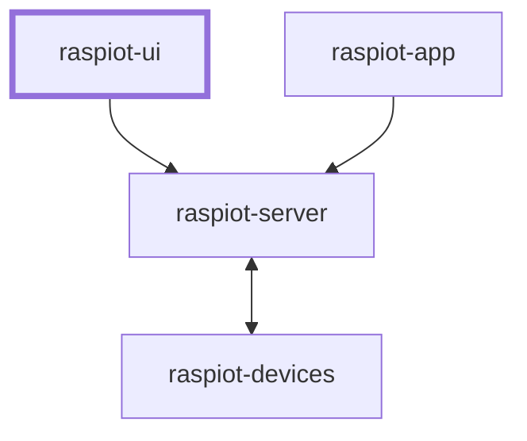

## raspiot-ui
#### UI interface for connecting to raspiot-server and supporting real-time interaction with IoT devices.
* On iOS, a UI interface has been implemented on [Scriptable](https://apps.apple.com/cn/app/scriptable/id1405459188) for connecting to [raspiot-server](https://github.com/huang-xinjie/raspiot-server) and supporting real-time interaction with IoT devices.
  The ui effect can be found in the iOS/ui screenshot directory.
